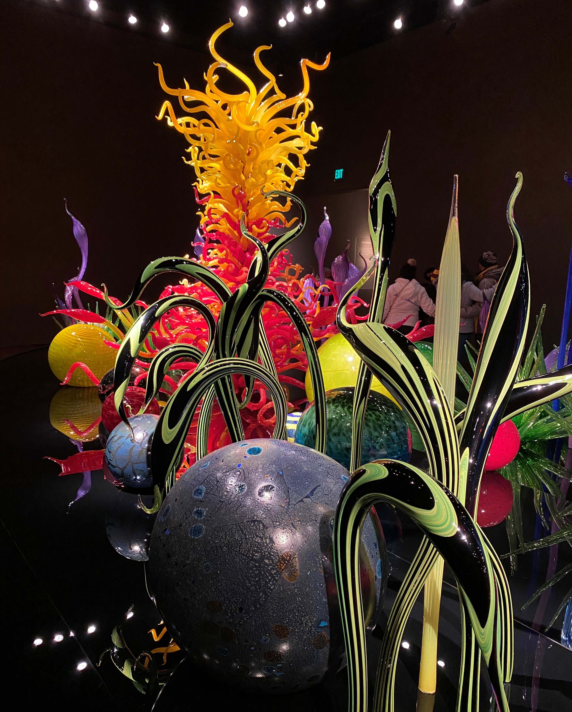

<!--

  

    

    

    

  

-->

I am Merve (mer-veh) Sarac (suh-ruch), from Turkey. Studying in a boarding high school, I admired many of my teachers. As I enjoyed Mathematics, I decided to study my bachelors in Secondary Mathematics Education at Bogazici University, Istanbul. [I was an exchange student visiting the Department of Mathematics at the University of Wisconsin-Madison for a semester in Spring 2013 before my graduation, and took a few graduate level courses.] Following my graduation, I completed my M.S. studies in Secondary Mathematics Education at Bogazici University. During my masters at Bogazici, I worked with Dr. Gulseren Karagoz-Akar, who was an influential scholar and incredibly supportive mentor, on perservice secondary mathematics teachers' understanding of the cartesian form of complex numbers as it relates to quantitative reasoning.

During my masters at Bogazici, I had an increased understanding of and curiosity about quantitative methods in educational and psychological research and psychometrics. This led me to my M.A. studies in the area of Research Methodology, Measurement, and Evaluation (RMME) at the Department of Educational Psychology, the University of Connecticut. Working with Dr. Eric Loken, I studied on a large-scale assessment data and explored omitting behavior and patterns as they related to individual- and item-specific factors. As I learned about the measurement theories during my masters, I have grown interest in how manifestations of various test-taking behavior impact the validity and fairness issues in educational and psychological assessments.

Next, I have decided to pursue a Ph.D. study in the Quantitative Methods area of the Department of Educational Psychology at the University of Wisconsin-Madison. I was already impressed with the academic atmosphere at UW-Madison when I visited for the exchange program. My research interests are currently in the theory and application of psychometric methods (e.g., IRT and latent variable models) in education and psychology. Working with Dr. James Wollack, my research focuses on (1) statistical modeling of aberrant testing-taking behavior in educational and psychological measurement and (2) psychometric methodologies for the item- and person-level anomaly detection in the form of test collusion and item preknowledge as well as their potential to provide insight into valid and fair testing. I have had various opportunities to collaborate on research projects at the National Board of Medical Examiners (NBME), American Institute of Certified Public Accountants (AICPA), and Testing and Evaluation Center at the UW-Madison. 

<!--

     

     	  

          

     	  

     

-->

I enjoy the glass art.

  

    

    

    

  

