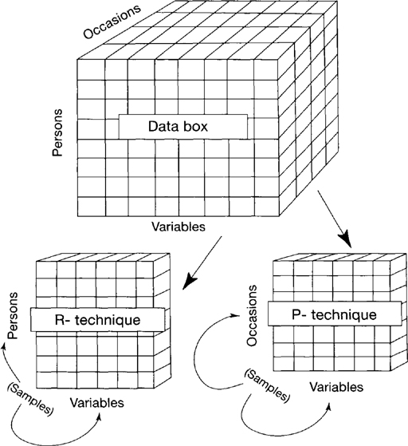
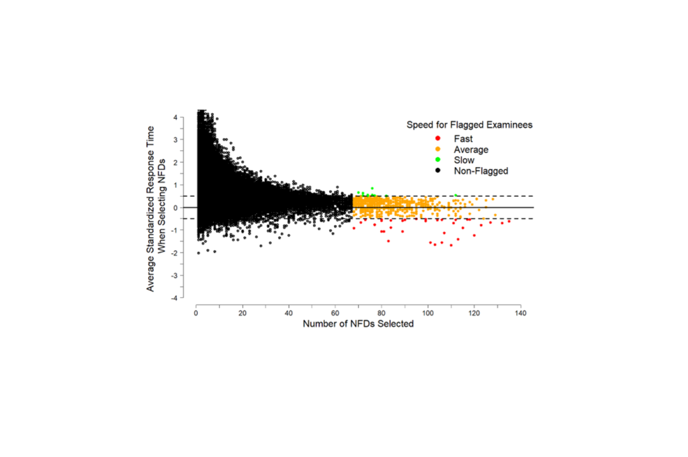
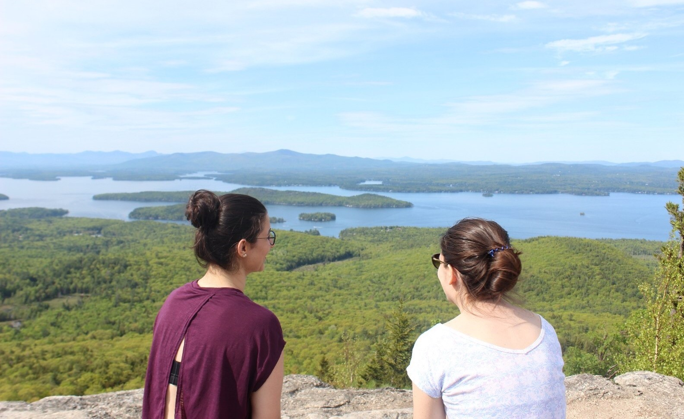

<!-- Section -->
<section>

  <header class="major">
    <h2><a id="target_about">About Me</a></h2>
  </header>
  

    <article>
      
      <h3>About Me</h3>
      
I am a Ph.D. student. I am from Turkey. 

      <ul class="actions">
	<li><a href="{{ 'about_me.html' | absolute_url }}" class="button">More</a></li>
      </ul>
    </article>
        <article>
      
      <h3>Teaching</h3>
      
Throughout the graduate school I have had many oppurtunities to be a part of undergraduate and graduate education.

      <ul class="actions">
	<li><a href="{{ 'teaching.html' | absolute_url }}" class="button">More</a></li>
      </ul>
    </article>
    <article>
      
      <h3>Research</h3>
      
 A brief description of each of my research projects along with links to the associated articles.

      <ul class="actions">
	<li><a href="{{ 'research.html' | absolute_url}}" class="button">More</a></li>
      </ul>
    </article>
        <article>
      
      <h3>CV</h3>
      
This is a copy of my CV, updated periodically.  

      <ul class="actions">
	<li><a href="{{ 'cv.html' | absolute_url }}" class="button">More</a></li>
      </ul>
    </article>
    <article>
      
      <h3>Software</h3>
      
A brief description and a link to some of the universally useful software that I wrote during graduate school.  

      <ul class="actions">
	<li><a href="{{ 'software.html' | absolute_url }}" class="button">More</a></li>
      </ul>
    </article>
    <article>
      
      <h3>Fun</h3>
      
I love the outdoors.

      <ul class="actions">
	<li><a href="{{ 'fun.html' | absolute_url }}" class="button">More</a></li>
      </ul>
    </article>
  

</section>
